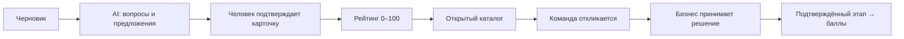
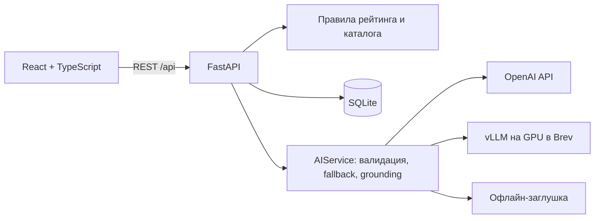

# AI Sana Challenge Hub

**От короткой бизнес-задачи до совместного проекта со студентами.** Бизнес описывает проблему, AI задаёт уточняющие вопросы и предлагает карточку с цитатами из ответов. Человек проверяет и подтверждает поля, а прозрачные правила считают рейтинг готовности от 0 до 100. Студенческие команды находят задачи в каталоге и отправляют отклики; бизнес сам выбирает исполнителей и подтверждает результаты этапов.

Проект создан на хакатоне **HackAlem AI**, трек **AI Sana**, кейс «Единый кейс по геймификации практических заданий».

**Что можно проверить в MVP:** весь путь от черновика до баллов команды, настоящий backend, AI Inspector, рекомендации, адаптивный интерфейс и светлую, тёмную или системную тему. Для запуска и проверки ключи AI-сервисов не нужны.

## Проблема и пользователи

Короткого описания «Хотим чат-бота для клиентов» недостаточно, чтобы команда оценила задачу и начала работу. Challenge Hub помогает бизнесу уточнить данные, ожидаемый результат, критерии успеха и ограничения. Рейтинг показывает пробелы и мотивирует дополнить карточку; студентам проще сравнивать задачи и выбирать подходящие по навыкам.

- **Бизнес:** конструктор задачи, подтверждение полей, подсказки по рейтингу, публикация, управление откликами и этапами.
- **Студенческие команды:** открытый каталог, рекомендации с объяснением, отклики и баллы за подтверждённую работу.

## Быстрый запуск без ключей

Команды ниже приведены для **PowerShell**. Нужен Git; затем выберите Docker или локальный запуск.

```powershell
git clone https://github.com/BAITC-Hacks/hack-4b695b60-ai-just.git
cd hack-4b695b60-ai-just
Copy-Item .env.example .env
```

В созданном `.env` замените две настройки, остальные оставьте по примеру:

```dotenv
AI_PROVIDER=stub
EMBED_PROVIDER_CHAIN=tfidf
```

Это включает офлайн-анализ и локальные рекомендации. Установка зависимостей или сборка Docker требует интернета; после неё основной сценарий работает без внешних AI-сервисов. Ключи в `.env.example` пустые, `.env` исключён из Git. Если `.env` у вас уже есть, измените нужные строки в нём, сохранив остальные настройки.

### Вариант A — Docker

Нужен Docker с Compose 2.24 или новее. Из корня репозитория:

```powershell
docker compose up --build
```

- **Интерфейс:** [http://localhost:8080](http://localhost:8080).
- **Документация API:** [http://localhost:8000/docs](http://localhost:8000/docs).
- **Состояние API:** [http://localhost:8000/api/health](http://localhost:8000/api/health).

При первом старте SQLite заполняется синтетическими демо-данными. В текущем Compose база находится внутри backend-контейнера: пересоздание контейнера может удалить изменения демо. Остановка — `Ctrl+C`, затем `docker compose down`.

### Вариант B — два локальных терминала

Нужны **Python 3.11+**, **uv**, **Node.js 24** и npm. Откройте оба терминала **в корне клонированного репозитория**.

**Терминал 1 — backend:**

```powershell
cd backend
uv sync --frozen
uv run uvicorn app.main:app --host 127.0.0.1 --port 8000
```

**Терминал 2 — frontend:**

```powershell
cd frontend
npm ci
$env:VITE_USE_MOCKS = "false"
$env:API_PROXY_TARGET = "http://127.0.0.1:8000"
npm run dev -- --host 127.0.0.1 --port 5173 --strictPort
```

Откройте **[http://127.0.0.1:5173](http://127.0.0.1:5173)**. Frontend отправляет `/api` на настоящий backend через Vite. База локального запуска сохраняется в `backend/app.db`. Оба процесса останавливаются `Ctrl+C` в своих терминалах.

## Проверка решения за 5 минут

Выберите роль **«Бизнес»**, компанию **«Дала Логистик»** и провайдер **«Офлайн»** в шапке. При свежем запуске доступны 6 опубликованных задач разных уровней готовности и 6 команд. Кнопка «Сбросить демо» возвращает начальный набор, удаляя изменения в текущей базе; для первого просмотра она не нужна.

| Шаг | Действие | Что проверить |
| --- | --- | --- |
| 1 | «Новая задача» → «Попробовать пример» → тема «Логистика» → «Проанализировать» | Не меньше 3 вопросов. Предложения AI имеют цитаты; рейтинг до подтверждения — 0 |
| 2 | «Подтвердить всё», затем ответить на вопросы и нажать «Собрать карточку» | Подтверждённые поля сохраняются. Новые предложения можно изменить, подтвердить или отклонить |
| 3 | Подтвердить карточку и дополнить поля по подсказкам | Рейтинг пересчитывается; видны причины, возможный прирост, история и прогноз позиции |
| 4 | «Опубликовать задачу» → проверить карточку → подтвердить публикацию | Задача появляется в каталоге. Публикация доступна и при низком рейтинге, если подтверждено название |
| 5 | Роль «Команда» → «Nomad AI» → каталог или рекомендации → открыть задачу | В каталоге видны все опубликованные задачи. В рекомендациях — задачи от 40 баллов с причинами совпадения |
| 6 | Заполнить идею, план и срок, затем «Отправить отклик» | Отклик появляется в разделе команды и у бизнеса |
| 7 | Роль «Бизнес» → «Мои задачи» → отклики → «Выбрать» | Решение меняется только по явному действию бизнеса. Другой отклик можно отклонить |
| 8 | Добавить этап выбранной команде и подтвердить выполнение | Начисляются баллы за этап, обновляется лидерборд |
| 9 | В конструкторе открыть «Как это работает» | AI Inspector показывает провайдера, промпты, схемы, ошибки и отклонённые предложения |

Для ответов на вопросы можно использовать синтетические данные:

- **Данные:** «Есть выгрузка обращений из CRM за 6 месяцев — около 12 000 записей в Excel, плюс FAQ на 40 вопросов. Данные обезличим и дадим доступ после NDA.»
- **Текущая ситуация:** «Колл-центр получает 300–400 звонков в день, 60% — вопросы о статусе доставки и сроках.»
- **Критерии успеха:** «Бот самостоятельно закрывает не менее 40% обращений о статусе доставки, среднее время ответа — до 10 секунд.»

Точный рейтинг зависит от заполненных и подтверждённых полей. Полный пример с остальными полями и откликом — в [сценарии демо](docs/demo-script.md), а воспроизводимый путь до 100 баллов — в [сквозном тесте настоящего API](frontend/tests/e2e/real-api.spec.ts).

## Принципы продукта



- **AI только предлагает.** Предложения не дают баллов до подтверждения. AI не перезаписывает уже подтверждённые поля.
- **Рейтинг считают правила.** Детерминированная функция, 7 критериев и 18 проверок. Расшифровка доступна в интерфейсе.
- **Каталог открыт для всех задач.** Сортировка по умолчанию: рейтинг по убыванию, дата публикации по возрастанию, затем ID. Низкий рейтинг не запрещает публикацию и отклики.
- **Рекомендации объяснимы.** Учитываются интересы, навыки и технологии команды; они не ограничивают каталог.
- **Бизнес выбирает вручную.** Автоназначения и AI-ранжирования команд нет. Можно выбрать несколько команд или отклонить отклики.

### Формула рейтинга

| Критерий | Поля | Максимум |
| --- | --- | ---: |
| Контекст и потребность | `context`, `need` | 20 |
| Данные и материалы | `data` | 20 |
| Ожидаемый результат | `expected_result` | 15 |
| Критерии успеха | `success_criteria` | 15 |
| Ограничения | `constraints` | 10 |
| Пользователи | `users` | 10 |
| Связь с бизнесом | `contact`, `interaction_format` | 10 |

Уровни: **0–39 — Черновик**, **40–69 — Рабочая**, **70–89 — Готовая**, **90–100 — Приоритетная**. «Черновик» здесь — уровень готовности: задача с таким уровнем тоже может быть опубликована. Все условия начисления, подсказки и баллы этапов описаны в [формуле рейтинга и геймификации](docs/rating-and-gamification.md).

## Архитектура и технологии



| Слой | Технологии |
| --- | --- |
| Backend | Python, FastAPI, Pydantic v2, SQLModel, SQLite, uv |
| AI и ML | OpenAI SDK, vLLM на Brev, NumPy, scikit-learn, RapidFuzz |
| Frontend | React 19, TypeScript, Vite, Tailwind CSS v4, Radix UI, TanStack Query, Recharts, Motion |
| Проверки | pytest, Ruff, Vitest, Oxlint, TypeScript, Playwright |
| Запуск | Docker Compose; локально — uvicorn и Vite |

Подробнее: [архитектура](docs/architecture.md) и [контракт API](docs/api-contract.md).

### AI, проверка источников и fallback

Для анализа и сборки карточки используются промпты с версиями, JSON-схемы и проверка Pydantic. При ошибке структуры выполняется одна попытка исправления ответа, затем переход к следующему провайдеру. Автоматическая цепочка по умолчанию: **OpenAI → Brev → офлайн-заглушка**.

В промптах v2 AI извлекает полные фрагменты исходного текста с цитатами. Проверка grounding требует точного совпадения цитат с источником и значения с этими цитатами, сохраняя отрицания и условия. Свободные перефразирования и непроверяемые значения отбрасываются с причиной в трассировке; их можно заполнить вручную. Проверка не устанавливает правдивость исходника и смысловую правильность выбора поля — перед публикацией человек проверяет карточку.

Email, телефоны и @-ники маскируются во всём входе внешнего LLM, включая ранее заданные вопросы. Для рекомендаций используются эмбеддинги OpenAI или локальный TF-IDF вместе с совпадением навыков. Brev — облачная GPU-инфраструктура для самостоятельного запуска модели; используйте синтетические данные и не считайте такой запуск гарантией, что данные остаются на вашем компьютере.

### Подключение необязательных AI-сервисов

Настройки хранятся **только в корневом `.env`**, после изменения перезапустите backend:

| Режим | Настройки |
| --- | --- |
| Только офлайн | `AI_PROVIDER=stub`, `EMBED_PROVIDER_CHAIN=tfidf` |
| OpenAI | `OPENAI_API_KEY`, `OPENAI_MODEL=gpt-6-luna`, `OPENAI_REASONING_EFFORT=low`, `AI_PROVIDER=openai` |
| Модель на Brev | `BREV_LLM_BASE_URL`, `BREV_LLM_MODEL`, `BREV_LLM_API_KEY`, `AI_PROVIDER=brev` |
| Автоматический fallback | `AI_PROVIDER=auto`, `AI_PROVIDER_CHAIN=openai,brev,stub` |

Эмбеддинги настраиваются отдельно через `EMBED_PROVIDER_CHAIN`; оставьте `tfidf`, если нужны только локальные рекомендации. При недоступности выбранного LLM приложение переходит к заглушке. Реально ответивший провайдер виден в AI Inspector; `/api/health` сообщает конфигурацию, но сам по себе не подтверждает успешный запрос к модели.

Инструкция запуска Nemotron через vLLM — [Brev](docs/nvidia-brev.md). При Docker-запуске backend и туннеле на хосте используйте `BREV_LLM_BASE_URL=http://host.docker.internal:8001/v1`. NVIDIA Build API в проекте не используется.

### Измеренное качество AI

В [сохранённом отчёте](backend/eval/reports/latest.md) сравниваются 12 размеченных синтетических черновиков, включая короткие описания, контакты и попытки подменить инструкции. Это исторический прогон промптов и grounding v1, до перехода к строгому извлечению v2. В нём каждый провайдер ответил на 12 из 12 примеров без fallback; текущие внешние модели с v2 заново не проверялись. Числа ниже не описывают качество новой версии.

| Провайдер | Precision | Recall | Field F1 | Отклонено grounding | ≥ 3 вопроса | P95 |
| --- | ---: | ---: | ---: | ---: | ---: | ---: |
| OpenAI `gpt-6-luna` | 0.7436 | 0.8529 | 0.7945 | 0% | 100% | 7.89 с |
| Nemotron 3 Nano на Brev | 0.4444 | 0.7059 | 0.5454 | 39% | 100% | 9.55 с |
| Офлайн-заглушка | 0.9655 | 0.8235 | 0.8889 | 0% | 100% | 0.032 с |

**Как читать результаты:** Field F1 измеряет обнаружение размеченных типов полей без `title`, а не смысловую точность всего текста. Новый показатель `final_guard_failure_rate` означает долю нарушений при повторной проверке тем же кодом, а не независимую оценку достоверности. Поэтому `semantic_hallucination_rate` оставлен `null` до отдельной смысловой оценки. Малый синтетический набор не позволяет переносить числа на любые реальные задачи. Стоимость запросов стенд пока не рассчитывает.

Для OpenAI выбран `reasoning_effort=low`: в [отдельном сравнении](backend/eval/reports/reasoning-comparison.md) он дал Field F1 0.7222 и P95 8.08 с; `none` — 0.6207 и 4.47 с. Это по одному прогону каждого режима, результаты могут меняться.

Повторить офлайн-eval из корня репозитория, сохранив новый отчёт отдельно:

```powershell
cd backend
uv run python -m eval.run_eval --providers stub --out "$env:TEMP/sana-eval"
```

Для сравнения подключённых сервисов замените `stub` на `stub,openai,brev`. В отчёте всегда проверяйте `provider_used`, чтобы отличать ответ модели от fallback.

## Автоматические проверки

Команды каждого блока выполняются **из корня репозитория в отдельном терминале**, после установки зависимостей.

**Backend:**

```powershell
cd backend
uv run pytest
uv run ruff check .
```

**Frontend:**

```powershell
cd frontend
npm run typecheck
npm run lint
npm test
npm run build
```

Backend-тесты проверяют рейтинг, API, каталог, ручные решения, grounding и fallback. Vitest проверяет логику на моках; Playwright ниже проходит настоящий backend.

### Сквозной тест на отдельной базе

Тест [real-api.spec.ts](frontend/tests/e2e/real-api.spec.ts) сбрасывает данные перед каждым сценарием. Следующая конфигурация направляет его в **отдельную тестовую базу**, сохраняя обычную `backend/app.db`.

**Терминал 1**, из корня:

```powershell
cd backend
$env:AI_PROVIDER = "stub"
$env:EMBED_PROVIDER_CHAIN = "tfidf"
$env:DATABASE_URL = "sqlite:///./e2e-review.db"
uv run uvicorn app.main:app --host 127.0.0.1 --port 18000
```

**Терминал 2**, из корня: тест поднимет отдельный frontend на порту 15173; обычный сайт на 5173 можно оставить открытым. Используется Google Chrome; если он ещё не установлен, выполните `npx playwright install chrome` из `frontend/`. Тест со сбросом базы требует явно указать адрес отдельного backend; без него сброс не выполняется.

```powershell
cd frontend
$env:E2E_PORT = "15173"
$env:VITE_USE_MOCKS = "true"
npx playwright test tests/e2e/demo.spec.ts

$env:VITE_USE_MOCKS = "false"
$env:API_PROXY_TARGET = "http://127.0.0.1:18000"
$env:E2E_API_URL = "http://127.0.0.1:18000/api"
npx playwright test tests/e2e/real-api.spec.ts tests/e2e/interface-controls.spec.ts
```

Проверяются четыре сценария: полный путь до подтверждённого этапа и баллов команды; каталог, фильтры и пустое состояние; управление списками и темой на компьютере и телефоне. Проверки интерфейса включают клавиатуру, возврат фокуса, меню внутри диалога и отсутствие горизонтального переполнения. После проверки остановите тестовый backend и закройте оба тестовых терминала, чтобы их переменные окружения не повлияли на обычный запуск.

## Данные и ограничения MVP

- [Демо-данные](data/seed/) синтетические: вымышленные компании и команды, email на `example.com`. [Eval-датасет](backend/eval/dataset.jsonl) содержит 12 размеченных черновиков.
- Регистрации и полноценной авторизации нет: роли и участники переключаются в шапке. API управления демо предназначен для локальной демонстрации.
- SQLite, один процесс backend; конфигурация не рассчитана на публичную эксплуатацию с реальными персональными данными.
- Есть адаптивная вёрстка и три режима темы. Интерфейс на русском; чат, уведомления, загрузка файлов и переводы не реализованы.
- Используются готовые модели без собственного обучения. Векторной БД нет, эмбеддинги хранятся в памяти.
- Маскирование покрывает email, телефоны и @-ники; имена людей и произвольные конфиденциальные сведения автоматически не обезличиваются.
- Качество предложений зависит от провайдера. Проверка цитат и ручное подтверждение остаются частью сценария для всех моделей.
- Публичного развёртывания в этом репозитории нет; инструкции выше предназначены для локального запуска.

## Навигация по репозиторию

| Путь | Содержимое |
| --- | --- |
| [`backend/app/`](backend/app/) | API, модели, правила рейтинга, AI-конвейер и рекомендации |
| [`backend/tests/`](backend/tests/) | Тесты backend |
| [`backend/eval/`](backend/eval/) | Датасет, запуск eval и отчёты |
| [`frontend/`](frontend/) | Интерфейс и браузерные тесты |
| [`infra/`](infra/) | Запуск vLLM на Brev, Dockerfile frontend и nginx |
| [`docs/README.md`](docs/README.md) | Карта документации |
| [`docs/demo-script.md`](docs/demo-script.md) | Тексты и последовательность демонстрации |

Распределение работы: [backend и ML](docs/team/A-backend-ml.md), [frontend и UX](docs/team/B-frontend-product.md). Правила проекта — [AGENTS.md](AGENTS.md).
