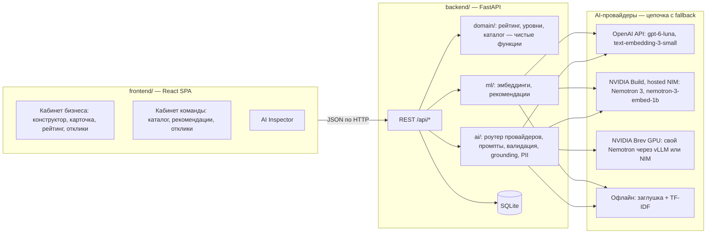
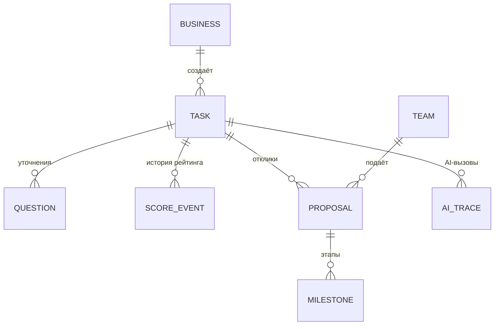
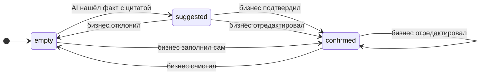
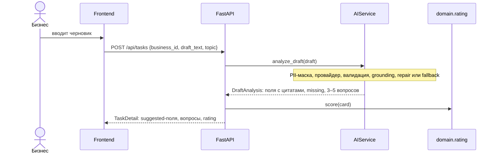
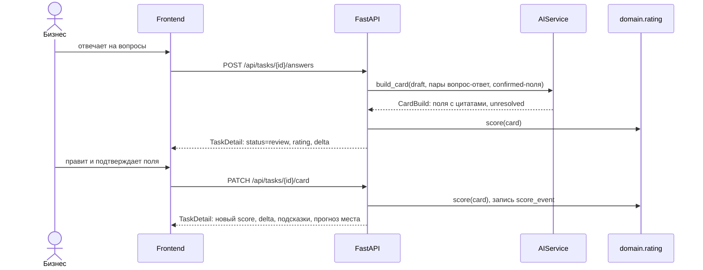
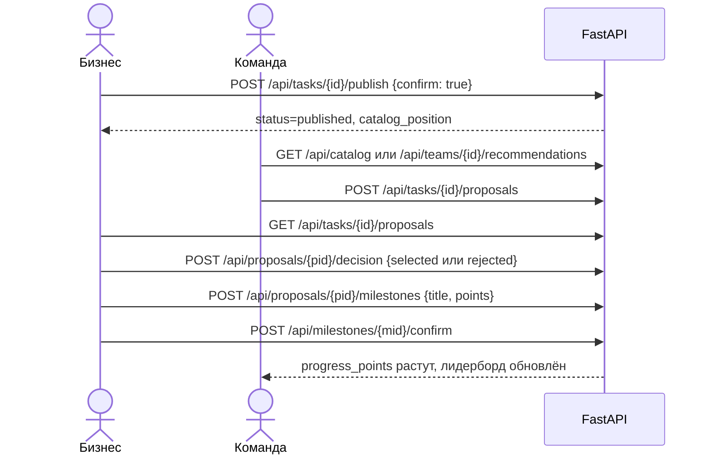

# Архитектура MVP

Это целевая архитектура: код пишется во время хакатона. Если код и документ расходятся, документ правится в том же изменении, что и код.

## 1. Обзор



Принципы:

1. **Бизнес-логика детерминирована.** Рейтинг, уровни и порядок каталога считаются чистыми функциями в `domain/`, без I/O и без AI. Одинаковая карточка всегда даёт одинаковый балл, и это покрыто тестами.
2. **AI изолирован за интерфейсом `AIService`** (`backend/app/ai/contracts.py`). Остальной backend и frontend работают с офлайн-заглушкой, поэтому их можно разрабатывать без ключей и без сети.
3. **AI только предлагает.** Всё, что заполнил AI, имеет статус `suggested`, пока человек не подтвердит.
4. **Минимум инфраструктуры:** один процесс backend и один файл SQLite. Очередей, Redis и векторной БД нет.

## 2. Стек

| Слой | Технологии | Почему |
| --- | --- | --- |
| Backend | Python 3.11, FastAPI, Pydantic v2, pydantic-settings, SQLModel + SQLite, Uvicorn | Быстрый старт, автодокументация OpenAPI, строгая валидация |
| AI-клиент | Python SDK `openai` | Одним клиентом ходим в OpenAI, NVIDIA Build и Brev (vLLM/NIM): все OpenAI-совместимы |
| ML | numpy, scikit-learn (TF-IDF), rapidfuzz | Рекомендации и grounding без тяжёлых зависимостей |
| Frontend | React 19, TypeScript, Vite, Tailwind CSS v4, shadcn/ui, TanStack Query, React Router, Recharts, motion, sonner | Готовый UI-кит, типы генерируются из OpenAPI |
| Инфраструктура | Docker Compose; NVIDIA Brev (опционально) | Запуск для жюри одной командой |
| Качество | pytest, ruff; ESLint, `tsc --noEmit` | |
| Пакеты | uv (backend), npm (frontend) | На машине A есть Python 3.11.9, Node 24, Docker; uv ставится одной командой |

## 3. Структура репозитория

```text
.
├── README.md                 # для жюри: что, зачем, как запустить
├── AGENTS.md                 # правила для AI-агентов (Codex, Cursor)
├── .env.example              # шаблон конфигурации без секретов
├── .gitignore                # .env, *.db, node_modules, .venv, dist, отчёты eval с сырыми ответами
├── docker-compose.yml
├── docs/                     # документация, см. docs/README.md
├── data/
│   └── seed/                 # синтетические данные: businesses, drafts, cards, teams, proposals, milestones (.json)
├── backend/                  # зона A
│   ├── pyproject.toml
│   ├── app/
│   │   ├── main.py           # FastAPI, CORS, подключение роутеров, seed при старте
│   │   ├── config.py         # Settings (pydantic-settings), читает ../.env и .env
│   │   ├── db.py             # engine, сессии SQLModel
│   │   ├── models.py         # таблицы
│   │   ├── schemas.py        # DTO API (Pydantic), совпадают с docs/api-contract.md
│   │   ├── errors.py         # доменные ошибки {"detail": {"code", "message"}}
│   │   ├── seed.py           # загрузка data/seed, пересчёт рейтингов
│   │   ├── api/              # роутеры: meta, participants, tasks, catalog, proposals, leaderboard, admin | ai, recommendations (зона A2)
│   │   ├── services/         # сценарии задачи поверх domain/ и AIService: создание, ответы, пересчёт
│   │   ├── domain/           # fields.py, rating.py, card.py, catalog.py — чистые функции
│   │   ├── ai/               # зона A2: contracts.py, router.py, providers/, prompts/, clarify.py, card_builder.py, grounding.py, pii.py, stub.py, question_bank.py, trace.py
│   │   └── ml/               # зона A2: embeddings.py, recommend.py, similarity.py
│   ├── eval/                 # зона A2: dataset.jsonl, run_eval.py, reports/
│   └── tests/                # A1: test_rating.py, test_catalog.py, test_api_flow.py | A2: test_ai_grounding.py, test_ai_router.py
├── frontend/                 # зона B
│   ├── package.json
│   ├── vite.config.ts        # proxy /api → http://localhost:8000
│   └── src/
│       ├── api/              # клиент, сгенерированные типы (schema.d.ts), моки
│       ├── components/       # ui/ (shadcn), rating/, card/, catalog/
│       ├── features/         # builder, catalog, proposals, business, leaderboard, inspector
│       ├── pages/
│       └── lib/
└── infra/
    └── brev/                 # зона A2: serve_vllm.sh, serve_nim.sh
```

## 4. Модель данных



| Таблица | Поля |
| --- | --- |
| `business` | `id`, `name`, `industry`, `created_at` |
| `team` | `id`, `name`, `interests` (JSON list), `skills` (JSON list), `technologies` (JSON list), `progress_points` (int, 0) |
| `task` | `id`, `business_id`, `status`, `topic`, `draft_text`, `card` (JSON), `score`, `potential_score`, `level`, `created_at`, `updated_at`, `published_at` |
| `question` | `id`, `task_id`, `key` (строка вида `q1`, уникальна в пределах задачи; в API отдаётся как `id`), `field`, `question`, `why`, `points_gain`, `answer` (nullable), `round`, `created_at` |
| `score_event` | `id`, `task_id`, `score`, `delta`, `level`, `reason`, `created_at` |
| `proposal` | `id`, `task_id`, `team_id`, `idea`, `plan`, `timeline`, `prototype_url` (nullable), `status`, `business_comment`, `created_at`, `decided_at` |
| `milestone` | `id`, `proposal_id`, `title`, `points` (по умолчанию 10), `status`, `created_at`, `confirmed_at` |
| `ai_trace` | `id`, `task_id` (nullable), `operation`, `provider`, `model`, `prompt_version`, `input_redacted`, `raw_output`, `parsed` (JSON), `status`, `errors` (JSON), `grounding_rejected` (JSON), `latency_ms`, `created_at` |

Поле карточки внутри `task.card` (словарь `FieldKey → CardField`):

```json
{
  "value": "Есть выгрузка обращений из CRM за 6 месяцев — около 12 000 записей в Excel",
  "status": "suggested",
  "source": "ai",
  "evidence": [{ "source": "answer:q1", "quote": "выгрузка обращений из CRM за 6 месяцев — около 12 000 записей в Excel" }],
  "updated_at": "2026-09-23T10:15:00Z"
}
```

Эмбеддинги хранятся в памяти процесса: словарь `(model, sha1(text)) → vector`, пересчёт при публикации. При десятках задач БД для этого не нужна.

## 5. Состояния



- **Задача:** `clarifying` (черновик проанализирован, вопросы заданы) → `review` (карточка собрана, идёт редактирование) → `published`. После публикации править можно: рейтинг и место в каталоге пересчитываются сразу.
- **Поле карточки:** схема выше. **AI никогда не перезаписывает `confirmed`-поля.**
- **Отклик:** `submitted` → `selected` или `rejected`. Решение меняет только бизнес, вручную. Можно выбрать несколько откликов или ни одного.
- **Этап:** `pending` → `confirmed`. Подтверждает только бизнес, и в этот момент к `team.progress_points` прибавляется `milestone.points`.

## 6. Ключевые потоки

### 6.1 Черновик → вопросы



### 6.2 Ответы → карточка → подтверждение



### 6.3 Публикация → отклик → решение → этап



## 7. Конфигурация

`.env` лежит в корне репозитория и **никогда не коммитится**. Backend читает `../.env` и `.env`. Шаблон `.env.example`:

```dotenv
# --- Приложение ---
APP_ENV=dev
DATABASE_URL=sqlite:///./app.db
SEED_DIR=../data/seed
SEED_ON_STARTUP=true
CORS_ORIGINS=http://localhost:5173

# --- Маршрутизация AI ---
# auto — идти по AI_PROVIDER_CHAIN; openai | nvidia | brev | stub — принудительно один провайдер
AI_PROVIDER=auto
AI_PROVIDER_CHAIN=openai,nvidia,brev,stub
AI_TIMEOUT_SECONDS=25
AI_MAX_REPAIR_ATTEMPTS=1
AI_REDACT_PII=true

# --- OpenAI ---
OPENAI_API_KEY=
OPENAI_MODEL=gpt-6-luna
OPENAI_REASONING_EFFORT=low
OPENAI_EMBED_MODEL=text-embedding-3-small

# --- NVIDIA Build (hosted NIM, OpenAI-совместимый) ---
NVIDIA_API_KEY=
NVIDIA_BASE_URL=https://integrate.api.nvidia.com/v1
NVIDIA_MODEL=nvidia/nemotron-3-nano-30b-a3b
NVIDIA_EMBED_MODEL=nvidia/nemotron-3-embed-1b

# --- NVIDIA Brev (своя модель: vLLM или NIM, OpenAI-совместимый) ---
# Пусто = провайдер выключен. После brev port-forward: http://localhost:8001/v1
BREV_LLM_BASE_URL=
BREV_LLM_MODEL=nemotron-3-nano
BREV_LLM_API_KEY=

# --- Эмбеддинги ---
EMBED_PROVIDER_CHAIN=nvidia,openai,tfidf
```

Провайдер без ключа или без доступного URL считается недоступным и пропускается. Так проект запускается у жюри вообще без ключей: работают заглушка и TF-IDF.

У frontend свой `frontend/.env.local`: `VITE_API_BASE_URL=http://localhost:8000`, `VITE_USE_MOCKS=false`. **Всё с префиксом `VITE_` попадает в бандл и видно в браузере, поэтому ключи туда класть нельзя.**

## 8. Валидация и ошибки

- Pydantic на входе каждого эндпоинта. Черновик — 10–4000 символов, ответ — до 2000, идея и план отклика — 20–3000, срок — до 200, ссылка — валидный `http(s)` URL.
- Доменные ошибки возвращаются как `{"detail": {"code": "...", "message": "..."}}` с кодом 400, 403, 404 или 409 (коды — в `docs/api-contract.md`). Ошибка валидации — стандартный ответ FastAPI с кодом 422.
- Ошибки AI до пользователя не доходят: роутер дойдёт до заглушки. В ответе `ai.provider_used` покажет, кто ответил, а `ai.degraded: true` — что это не основной провайдер.
- Все AI-вызовы, включая неудачные попытки, пишутся в `ai_trace` и видны в AI Inspector.

## 9. Режимы запуска

| Режим | Как | Когда |
| --- | --- | --- |
| Разработка | backend `:8000` (`uv run uvicorn app.main:app --reload`) + frontend `:5173` (`npm run dev`, proxy `/api`) | Основной |
| Docker | `docker compose up --build` | Для жюри и финальной проверки |
| Офлайн | `AI_PROVIDER=stub`, `EMBED_PROVIDER_CHAIN=tfidf` | Нет сети или ключей, страховка на демо |
| Приватный | `AI_PROVIDER=brev`: своя модель на GPU NVIDIA Brev | Показать, что черновики не уходят третьим лицам |

## 10. Что сознательно не делаем

Регистрацию и пароли (вместо них переключатель ролей), realtime, уведомления, файловое хранилище, векторную БД (numpy в памяти), обучение своих моделей (берём готовые), миграции БД (`create_all` и пересоздание из seed), мобильную вёрстку, прод-деплой.
